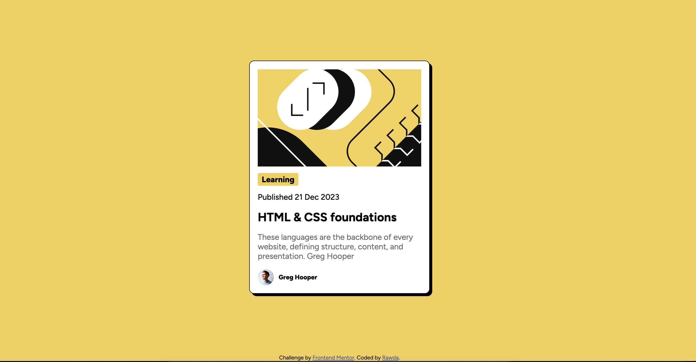
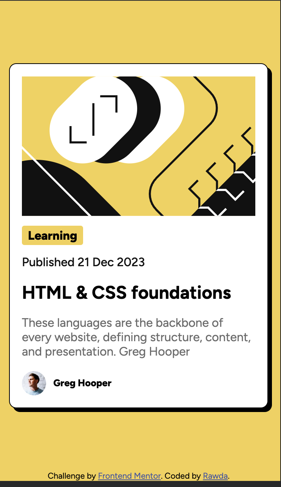

# Frontend Mentor - Blog preview card solution

This is a solution to the [Blog preview card challenge on Frontend Mentor](https://www.frontendmentor.io/challenges/blog-preview-card-ckPaj01IcS). Frontend Mentor challenges help you improve your coding skills by building realistic projects. 

## Table of contents

- [Overview](#overview)
  - [The challenge](#the-challenge)
  - [Screenshot](#screenshot)
  - [Links](#links)
- [My process](#my-process)
  - [Built with](#built-with)
  - [What I learned](#what-i-learned)
  - [Continued development](#continued-development)
  - [Useful resources](#useful-resources)
  - [AI Collaboration](#ai-collaboration)
- [Author](#author)
- [Acknowledgments](#acknowledgments)

## Overview

### The challenge

Implement the card with active state where in case of hovering using the mouse the color of the text will change

### Screenshot

**Desktop View**

**Mobile View**

### Links

- Live Site URL: https://rawda-yousry.github.io/blog-preview-card-main/

## My process

### Built with

- Semantic HTML5 markup
- CSS custom properties
- Flexbox

### What I learned

learned about flexbox, flex property, alignemnt, pseudo classes and specificity

### Useful resources

- https://www.udemy.com/share/1069Eo3@udGwpBbZwY0nDiLCA1vL4SNaUK5vyJmbKhx-1ubAsrcy6rwbXBy1e3acDXu9SCezbg==/